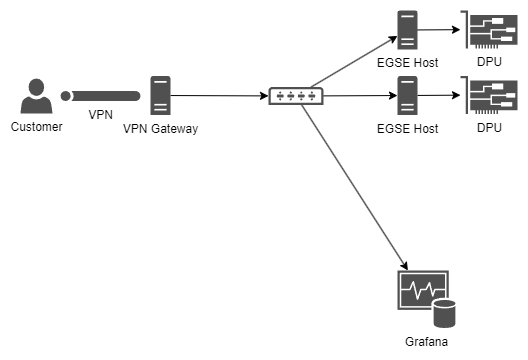

Customer network
================

Smart Mission Lab network provides access to three kinds of resources:

* EGSE Hosts with DPUs
* Network Attached Storage (NAS)
* Grafana

.. _customer-network:

    View of Smart Mission Lab from customer's perspective

VPN Gateway
-----------

Customer gains access to Smart Mission Lab network through VPN Gateway using OpenVPN. Connection profile (``.ovpn`` file) is available on Smart Mission Lab website. After downloading, customer can use any OpenVPN-compatible client to establish connection (see :doc:`/tutorials/setting_up_vpn`).

Customer gets access to VPN with start of first subscription. The same configuration profile gives access to all active subscriptions. After last active subscription ends, VPN access expires. There is no guarantee that the same configuration profile will remain unchanged for future subscriptions, so it's advised to download it again.

Certificate in configuration profile has expiration date set to 1 year from the creation date (start of first subscription). After that, OpenVPN will refuse to connect and customer will have to download new configuration profile from Smart Mission Lab website.

.. note:: OpenVPN client configures customer's machine to route **only** traffic destined to Smart Mission Lab network through VPN Gateway. All other traffic goes through customer's default gateway.

.. warning:: Due to Smart Mission Lab network configuration each customer might have **only one** active VPN connection at the same time.

EGSE Hosts
----------

EGSE Hosts are physical machines connected to Smart Mission Lab network on one side and to DPU on another. Customer can access EGSE Hosts using SSH and use provided utilities to control DPU - starting from power control to loading customized Linux distribution using JTAG. It's important to note that DPU itself doesn't have access to Smart Mission Lab network and customer can't access it directly from their machine.

Read more about EGSE Host in :doc:`/explain/egse_host`.

Network Attached Storage
------------------------

Each customer gets access to a dedicated space on Network Attached Storage (NAS) where they can store data and use it from any EGSE Host.

.. note:: TODO

Grafana
-------

Smart Mission Lab collects telemetry from all DPUs and customer can explore it using Grafana. KP Labs provides set of basic dashboards that show all telemetry values from each board. Customer can also define their own dashboard as they see fit. Underlying data source is a Prometheus-compatible databases which support PromQL queries.

Stored telemetry isn't limited to currently subscribed DPUs - database includes all telemetry values from all DPUs subscribed at . Each series contain EGSE Host host name as a label to distinguish between different instances.

Read more about Grafana in :doc:`/explain/grafana`.
