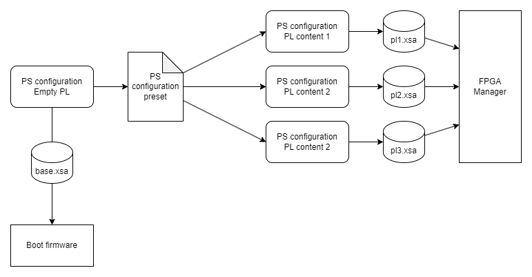

Enable programmable logic support
=================================

Goal
----
In this tutorial you will
    - Expand Vivado project from :doc:`/tutorials/leopard/zero_to_hero/minimalist_vivado_project` for Leopard DPU with support for Programmable Logic
    - Build bitstream with two UART peripherals connected together

A bit of background
-------------------
Leopard DPU configuration that you created in :doc:`/tutorials/leopard/zero_to_hero/minimalist_vivado_project` tutorial has support only for Processing System. Usage of **Programmable Logic** part of Zynq UltraScale+ requires following capabilities from Processing System side:

* Clock for programmable logic
* Interrupt lines between Processing System and Programmable Logic
* Memory interface between Processing System and Programmable Logic

Zynq UltraScale+ IP block (the same block that you used to configure base settings like DDR memory or I/O pins) configures these options. All Vivado projects describing different "content" of Programmable Logic must use the same base settings. Vivado provides **preset** mechanism to transfer processing system configuration between projects.

    Multiple Vivado projects sharing Processing System configuration using presets and producing different ``.xsa`` files.

Building content for programmable logic involves putting different IP blocks on block design, connecting them together using memory interfaces, interrupts, and clocks. To be usable from Linux distribution, IPs connect to "extension points" provided by Processing System.

Vivado stores content for Programmable Logic in ``.xsa`` file in form called **bitstream**. Using running Linux operating system you can use **FPGA Manager** to load different bitstreams to Programmable Logic.

Prerequisites
-------------
* Base Leopard DPU project from :doc:`/tutorials/leopard/zero_to_hero/minimalist_vivado_project`
* Base Yocto project for Leopard DPU from :doc:`/tutorials/leopard/zero_to_hero/minimalist_linux_distro`
* EGSE Host prepared to boot Leopard DPU from network as described in :doc:`/tutorials/leopard/zero_to_hero/minimalist_linux_distro`

Provided outputs
----------------
Following files (:ref:`tutorial_files`) are associated with this tutorial:

* :file:`Leopard/Zero-to-hero/03 Enable programmable logic support/leopard-minimalistic-with-pl.tcl` - Vivado preset for Leopard with enabled PL support
* :file:`Leopard/Zero-to-hero/03 Enable programmable logic support/leopard-minimalistic-pl-base.xsa` - Base XSA file with enabled PL support
* :file:`Leopard/Zero-to-hero/03 Enable programmable logic support/leopard-double-uart.xsa` - Double UART XSA file
* :file:`Leopard/Zero-to-hero/03 Enable programmable logic support/boot-common.bin` - Boot firmware for Leopard
* :file:`Leopard/Zero-to-hero/03 Enable programmable logic support/dpu-leopard-leopard-dpu.rootfs.cpio.gz.u-boot` - Root filesystem for Leopard
* :file:`Leopard/Zero-to-hero/03 Enable programmable logic support/Image` - Linux kernel
* :file:`Leopard/Zero-to-hero/03 Enable programmable logic support/system.dtb` - Device tree

Use these files if you want to skip building bitstream or Yocto distribution by yourself.

Enable programmable logic support :tutorial-machine:`Vivado`
------------------------------------------------------------
#. Open Leopard DPU project from :doc:`/tutorials/leopard/zero_to_hero/minimalist_vivado_project` in Vivado
#. Use :menuselection:`Open Block Design` option to open ``top_bd`` block design
#. Customize Zynq UltraScale+ block by double-clicking on it

   * Enable PL to PS interrupts ``IRQ0[0-7]``
   * Enable PS-PL Master interface ``AXI HPM0 FPD``
   * Enable PL-PS Slave interfaces

     * Enable ``AXI HPC0 FPD``
     * Enable ``AXI HPC1 FPD``
     * Enable ``AXI LPD``, set Data Width to 32 bits

   * Enable Fabric Reset Enable
   * Set Number of Fabric Resets to 1
   * Enable PL fabric clock in Output clocks tab

     * Enable ``PL0`` and set it to 100MHz

#. In ``top_bd`` block design connect ``maxihpm0_fpd_aclk`` to ``pl0_clk``
#. In ``top_bd`` block design connect ``saxihpc0_fpd_aclk`` to ``pl0_clk``
#. In ``top_bd`` block design connect ``saxihpc1_fpd_aclk`` to ``pl0_clk``
#. In ``top_bd`` block design connect ``saxi_lpd_aclk`` to ``pl0_clk``
#. At this point block design should contain single IP block with each clock connected to ``pl0_clk``

   .. figure:: ./enable_pl_support/leopard_pl_support_enabled.png
      :align: center

      Block design with Zynq UltraScale+ IP block configured to support Programmable Logic

#. Open customization of Zynq UltraScale+ IP block and export preset by selecting  :menuselection:`Presets --> Save configuration`

   * Use ``leopard-minimalistic-with-pl`` as preset name
   * Save to ``leopard-minimalistic-with-pl.tcl`` file

#. Generate bitstream
#. Export hardware without bitstream. Use ``leopard-minimalistic-pl-base.xsa`` for output file name.

.. note:: Selected Zynq UltraScale+ configuration covers needs of programmable logic content in this tutorial and next ones.

Create double UART bitstream :tutorial-machine:`Vivado`
-------------------------------------------------------

#. Start Vivado and create new project. In new project wizard select following options:

   * Project type: RTL Project

     * Select :menuselection:`Don't specify sources at this time`
     * Don't select :menuselection:`Project is an extensible Vitis platform`

   * Part: ``xczu9eg-ffvc900-1L-i``

#. Create top-level block design by using :menuselection:`Create Block Design` in Flow Navigator. Use ``double_uart_bd`` as name.
#. In block design diagram editor add Zynq UltraScale+ MPSoC IP block.
#. Start customization of Zynq UltraScale+ MPSoC IP block by double-clicking on it.

   1. Apply previously exported preset by selecting :menuselection:`Presets --> Apply configuration` and select :file:`leopard-minimalistic-with-pl.tcl` file.

#. In ``double_uart_bd`` block design connect ``maxihpm0_fpd_aclk`` to ``pl0_clk``.
#. In ``double_uart_bd`` block design connect ``saxihpc0_fpd_aclk`` to ``pl0_clk``
#. In ``double_uart_bd`` block design connect ``saxihpc1_fpd_aclk`` to ``pl0_clk``
#. In ``double_uart_bd`` block design connect ``saxi_lpd_aclk`` to ``pl0_clk``
#. Place two AXI Uartlite IPs on block design
#. Cross-connect UARTs by connecting ``axu_uartlite1`` TX to ``axu_uartlite0`` RX and vice versa.
#. Click ``Run connection automation`` and let Vivado instantiate necessary interconnects and resets.
#. Add ``Concat`` IP block
#. Connect ``dout`` pin of ``Concat`` block to ``pl_ps_irq`` pin of Zynq UltraScale+ block
#. Connect ``interrupt`` pin of ``axi_uartlite0`` to ``In0`` of ``Concat`` block
#. Connect ``interrupt`` pin of ``axi_uartlite1`` to ``In1`` of ``Concat`` block
#. Final block design should look like this:

   .. figure:: ./enable_pl_support/leopard_double_uart_bd.png
       :align: center

       Block design with double UARTs connected together and available to Processing System

#. In Sources view select :menuselection:`Design Sources --> double_uart_bd` and click :menuselection:`Create HDL Wrapper`` in context menu. Use :menuselection:`Let Vivado manage wrapper and auto-update` option.
#. Generate bitstream
#. Export hardware including bitstream to file ``leopard-double-uart.xsa``

Enable programmable logic support in boot firmware :tutorial-machine:`Yocto`
----------------------------------------------------------------------------
#. Add :file:`leopard-minimalistic-pl-base.xsa` to :file:`sources/meta-local/recipes-bsp/hdf/external-hdf/` directory.
#. Modify :file:`sources/meta-local/recipes-bsp/hdf/external-hdf_%.bbappend` to use new XSA file.

   .. code-block:: bitbake

        HDF_BASE = "file://"
        HDF_PATH = "leopard-minimalistic-pl-base.xsa"

Add double UART bitstream to Linux distribution :tutorial-machine:`Yocto`
-------------------------------------------------------------------------
#. Create directory :file:`sources/meta-local/recipes-example/bitstreams/double-uart/` and copy :file:`leopard-double-uart.xsa` to it.
#. Create new recipe :file:`sources/meta-local/recipes-example/bitstreams/double-uart.bb` that will install bitstream with double UART.

   .. code-block:: bitbake

        LICENSE = "CLOSED"

        inherit bitstream

        SRC_URI += "file://leopard-double-uart.xsa"
        BITSTREAM_HDF_FILE = "${WORKDIR}/leopard-double-uart.xsa"

#. Create append for ``leopard-all`` recipe

   .. code-block:: shell-session

        machine:~/leopard-linux-1/build$ recipetool newappend ../sources/meta-local/ dpu-leopard
        NOTE: Starting bitbake server...
        WARNING: The ZynqMP pmu-rom is not enabled, qemu may not be able to emulate a ZynqMP system without it. To enable this you must add 'xilinx' to the LICENSE_FLAGS_ACCEPTED to indicate you accept the software license.
        Loading cache: 100% |#############################################################################################################################################################################| Time: 0:00:00
        Loaded 3317 entries from dependency cache.
        Parsing recipes: 100% |###########################################################################################################################################################################| Time: 0:00:00
        Parsing of 2006 .bb files complete (2004 cached, 2 parsed). 3318 targets, 570 skipped, 0 masked, 0 errors.
        WARNING: No bb files in default matched BBFILE_PATTERN_meta-kp-classes '^~/leopard-linux-1/sources/meta-kp-classes/meta-kp-classes/'

        Summary: There was 1 WARNING message.
        ~/leopard-linux-1/sources/meta-local/recipes-leopard/images/dpu-leopard.bbappend

#. Add new packages into Linux image by editing :file:`sources/meta-local/recipes-leopard/images/dpu-leopard.bbappend`

   .. code-block:: bitbake

        IMAGE_INSTALL += "\
            fpga-manager-script \
            double-uart \
        "

#. Build firmware and image

   .. code-block:: shell-session

       machine:~/leopard-linux-1/build$ bitbake leopard-all

#. Prepare build artifacts for transfer to EGSE Host

   .. code-block:: shell-session

        machine:~/leopard-linux-1/build$ mkdir -p ../egse-host-transfer
        machine:~/leopard-linux-1/build$ cp tmp/deploy/images/leopard-dpu/bootbins/boot-common.bin ../egse-host-transfer
        machine:~/leopard-linux-1/build$ cp tmp/deploy/images/leopard-dpu/system.dtb ../egse-host-transfer
        machine:~/leopard-linux-1/build$ cp tmp/deploy/images/leopard-dpu/dpu-leopard-leopard-dpu.rootfs.cpio.gz.u-boot ../egse-host-transfer
        machine:~/leopard-linux-1/build$ cp tmp/deploy/images/leopard-dpu/Image ../egse-host-transfer

#. Transfer content of :file:`egse-host-transfer` directory to EGSE Host and place it in :file:`/var/tftp/tutorial` directory

Loading double UART bitstream on DPU :tutorial-machine:`EGSE Host`
------------------------------------------------------------------

#. Verify that all necessary artifacts are present on EGSE Host:

   .. code-block:: shell-session

       customer@egse-host:~$ ls -lh /var/tftp/tutorial
       total 48M
       -rw-rw-r-- 1 customer customer  21M Jan 22 13:30 Image
       -rw-rw-r-- 1 customer customer 1.6M Jan 22 13:30 boot-common.bin
       -rw-rw-r-- 1 customer customer  35M Jan 22 13:30 dpu-leopard-leopard-dpu.rootfs.cpio.gz.u-boot
       -rw-rw-r-- 1 customer customer  39K Jan 22 13:30 system.dtb

   .. note:: Exact file size might differ a bit but they should be in the same range (for example ``dpu-leopard-leopard-dpu.rootfs.cpio.gz.u-boot`` shall be about ~40MB)

#. Open second SSH connection to EGSE Host and start ``minicom`` to observe boot process

   .. code-block:: shell-session

       customer@egse-host:~$ minicom -D /dev/sml/leopard-pn1-uart

   Leave this terminal open and get back to SSH connection used in previous steps.

#. Power on Leopard

   .. code-block:: shell-session

       customer@egse-host:~$ sml power on
       Powering on...Success

#. Power on DPU Processing Node 1

   .. code-block:: shell-session

       customer@egse-host:~$ sml pn1 power on --nor-memory nor1
       Powering on processing node Node1...Success

#. Write boot firmware to DPU boot flash

   .. code-block:: shell-session

       customer@egse-host:~$ sml boot-flash write --nor-memory nor1 0 /var/tftp/tutorial/boot-common.bin
       Uploading   ━━━━━━━━━━━━━━━━━━━━━━━━━━━━━━━━━━━━━━━━ 100% 0:00:00 48.6 MB/s
       Erasing     ━━━━━━━━━━━━━━━━━━━━━━━━━━━━━━━━━━━━━━━━ 100% 0:00:00 553.3 kB/s
       Programming ━━━━━━━━━━━━━━━━━━━━━━━━━━━━━━━━━━━━━━━━ 100% 0:00:00 13.5 kB/s

#. Power on Processing Node 1

   .. code-block:: shell-session

       customer@egse-host:~$ sml pn1 power on --nor-memory nor1
       Powering on processing node Node1...Success

#. DPU boot process should be visible in ``minicom`` terminal

#. Log in to DPU using ``root`` user

   .. code-block:: shell-session

      leopard login: root
      root@leopard:~#

#. Load double UART bitstream

   .. code-block:: shell-session

      root@leopard:~# fpgautil -o /lib/firmware/double-uart/overlay.dtbo
      [   17.334051] fpga_manager fpga0: writing double-uart/bitstream.bit.bin to Xilinx ZynqMP FPGA Manager
      [   17.478795] OF: overlay: WARNING: memory leak will occur if overlay removed, property: /fpga-full/firmware-name
      [   17.488941] OF: overlay: WARNING: memory leak will occur if overlay removed, property: /fpga-full/resets
      [   17.498582] OF: overlay: WARNING: memory leak will occur if overlay removed, property: /__symbols__/afi0
      [   17.508081] OF: overlay: WARNING: memory leak will occur if overlay removed, property: /__symbols__/axi_uartlite_0
      [   17.518445] OF: overlay: WARNING: memory leak will occur if overlay removed, property: /__symbols__/axi_uartlite_1
      [   17.532846] a0000000.serial: ttyUL0 at MMIO 0xa0000000 (irq = 45, base_baud = 0) is a uartlite
      [   17.543564] uartlite a0000000.serial: Runtime PM usage count underflow!
      [   17.553041] a0010000.serial: ttyUL1 at MMIO 0xa0010000 (irq = 46, base_baud = 0) is a uartlite
      [   17.563853] uartlite a0010000.serial: Runtime PM usage count underflow!
      root@leopard:~#

   .. note:: Despite warnings UARTs in bitstream will still function correctly

#. Verify presence of two new UART devices

   .. code-block:: shell-session

       root@leopard:~# ls -l /dev/ttyUL*
       crw-rw----    1 root     dialout   204, 187 Sep 20 11:23 /dev/ttyUL0
       crw-rw----    1 root     dialout   204, 188 Sep 20 11:23 /dev/ttyUL1

#. Start receiving data from ``/dev/ttyUL0`` in background

   .. code-block:: shell-session

      root@leopard:~# cat /dev/ttyUL0 &

   ``cat`` process will be running in background allowing you to enter another command in the same terminal. Output from ``cat`` (data received from UART) and your commands will mix in terminal.

#. Write something to second UART:

   .. code-block:: shell-session

      root@leopard:~# echo "Hello from UART1" > /dev/ttyUL1
      Hello from UART1
      root@leopard:~#

   Text ``Hello from UART1`` is coming from ``cat`` running in background.

Summary
-------
In this tutorial, you enabled usage of Programmable Logic part of Zynq UltraScale+ device. As an example, you added bitstream with two UARTs connected together. After rebuilding Yocto project, you used FPGA Manager to load bitstream dynamically and used newly added devices.
