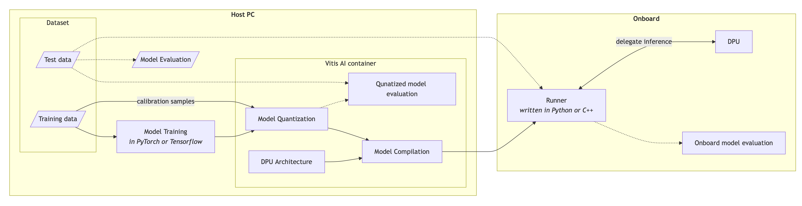

Machine learning model deployment
=================================
Model deployment with Vitis AI supports models trained in PyTorch and TensorFlow. However, the process differs depending on the framework. With Vitis AI tools you can convert the model to a format compatible with the target DPU platform and leverage the hardware acceleration on the edge. The conversion process consists of two steps: quantization and compilation. You can run the deployed model onboard of the target device using the inference program written in Python or C++. The flowchart below illustrates the deployment process:

The following tutorials demonstrate deploying a PyTorch-based land cover segmentation model to Antelope, with the inference program written in Python.

.. toctree::
    :maxdepth: 1

    model_training
    model_deployment/index
    onboard_model_runner_python
